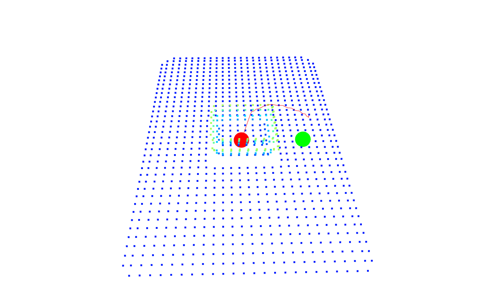

## Path Planning and Obstacle Avoidance for Kuka Robotic Arm using Artificial Potential Field

### Introduction
This project implements obstacle avoidance for a **Kuka robotic arm** using the **Artificial Potential Field (APF) method**. The simulation is conducted in **PyBullet**, and point cloud data is processed using **Open3D**.
<div align="center">
    
</div>

### Features
- **Point Cloud Processing**: Generates and processes 3D point clouds of the environment.
- **Artificial Potential Field (APF)**: Computes attractive and repulsive forces for navigation.
- **Path Planning**: Uses **gradient descent** for trajectory generation.
- **Kuka Arm Simulation**: Executes motion in **PyBullet** while avoiding obstacles.
- **Visualization**: Uses Open3D for point cloud and trajectory visualization.

---
### Project Structure
- **`getPLY.py`**: Captures depth images in PyBullet and converts them into a **PLY point cloud**.
- **`plySEE.py`**: Filters and visualizes the generated point cloud.
- **`apf2.py`**: Implements **APF-based path planning**, including:
  - Point cloud loading and processing
  - Attractive and repulsive potential field computation
  - Path generation using gradient descent
  - 3D visualization of the environment and trajectory
- **`APF.py`**: Integrates **APF planning with the Kuka robot simulation**, executing path following in **PyBullet**.

---
### Dependencies
Ensure the following Python packages are installed:
```bash
pip install numpy open3d matplotlib pybullet opencv-python
```

---
### Usage
#### 1. Generate Point Cloud Data
Run `getPLY.py` to capture depth images and convert them into a **PLY point cloud**:
```bash
python getPLY.py
```
This will create a `point_cloud.ply` file in the `image/` directory.

#### 2. Filter and Visualize the Point Cloud
To remove noisy points and visualize the processed cloud:
```bash
python plySEE.py
```
This generates `filtered_point_cloud.ply`.

#### 3. Compute APF-Based Path
Run `apf2.py` to generate an **APF trajectory** and visualize the result:
```bash
python apf2.py
```

#### 4. Simulate in PyBullet
Finally, execute `APF.py` to move the **Kuka robotic arm** while avoiding obstacles:
```bash
python APF.py
```
This runs the simulation and controls the robotic arm.

---
### How It Works
1. **Point Cloud Processing**:
   - PyBullet generates depth images and converts them into a **PLY point cloud**.
   - Open3D filters noise and downsamples the cloud.
2. **APF-Based Path Planning**:
   - Computes **attractive** force (pulling the robot towards the goal).
   - Computes **repulsive** force (pushing the robot away from obstacles).
   - Uses **gradient descent** to iteratively generate a safe path.
3. **Kuka Arm Motion Execution**:
   - Uses **inverse kinematics (IK)** to convert path points into joint angles.
   - Controls the robotic arm using **PyBullet**.

---
### Future Improvements
- **Dynamic obstacle avoidance** using real-time updates.
- **Reinforcement Learning (RL)** integration for adaptive planning.
- **Multi-robot coordination** to handle complex scenarios.

---
### License
This project is licensed under the **MIT License**.

